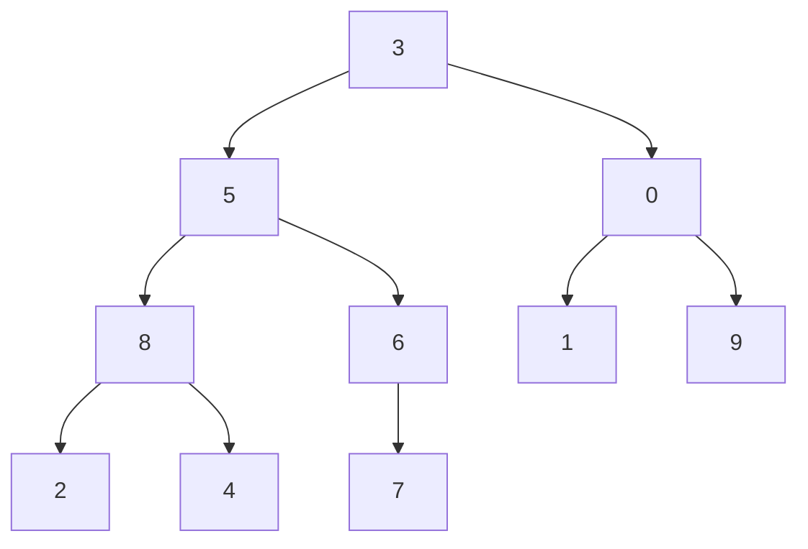
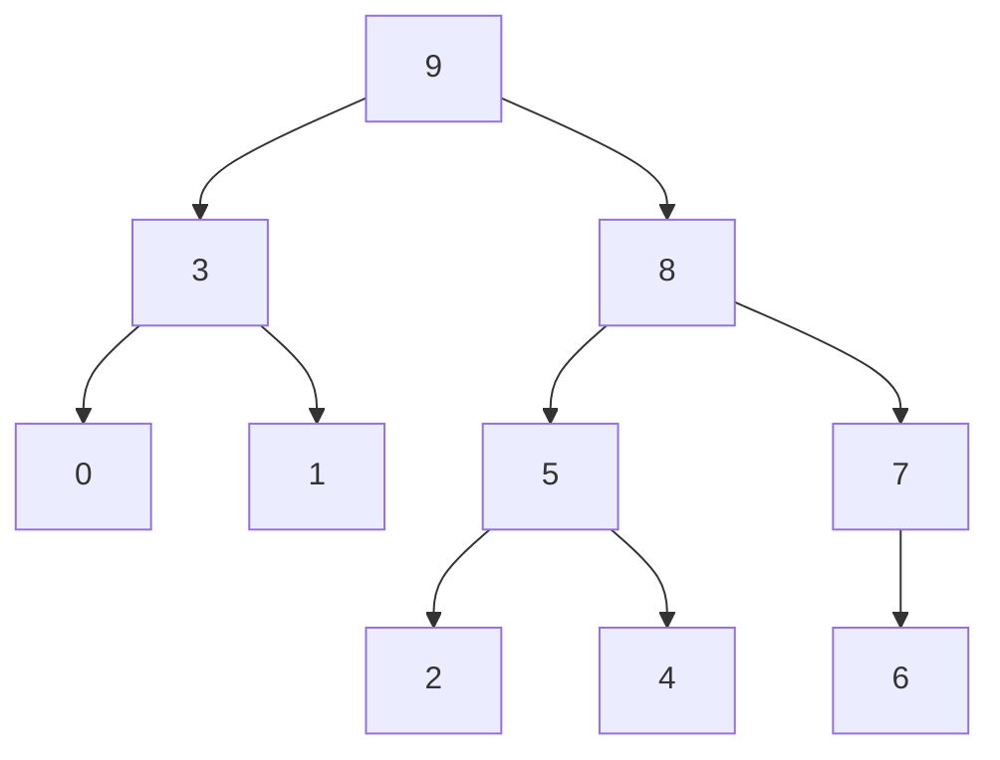
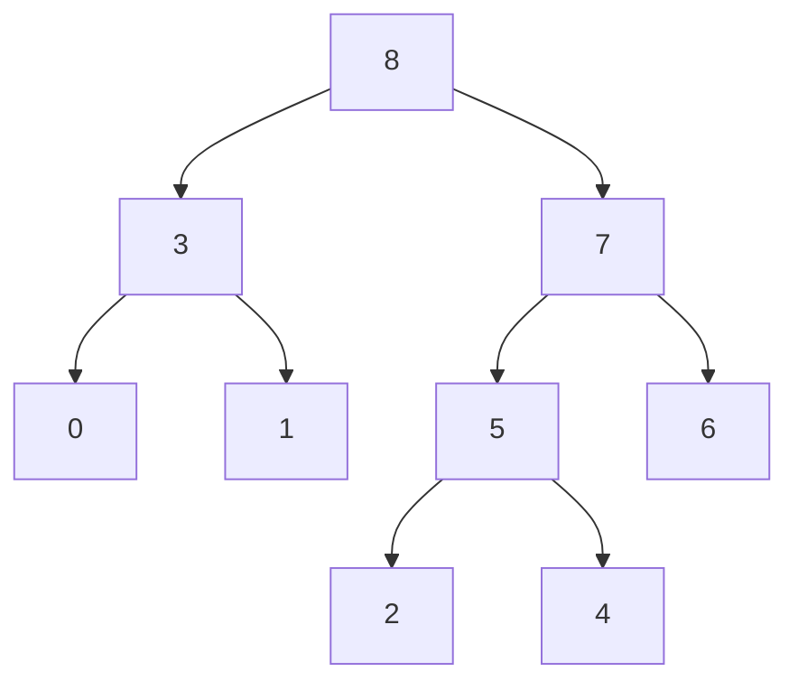

## 堆排序 ##

**数组**
  var arr = [3, 5, 0, 8, 6, 1, 9, 2, 4, 7];
**看作这样的二叉树** 


#### 第一步，使这个数组如上表示的二叉树变成一个最大堆
```
    var len = arr.length;
    /*
     *  第一步：将数组堆化
     *  beginIndex = 第一个非叶子节点。
     *  从第一个非叶子节点开始即可。无需从最后一个叶子节点开始。
     *  叶子节点可以看作已符合堆要求的节点，根节点就是它自己且自己以下值为最大。
     */
    for (var beginIndex = Math.floor(len / 2) - 1; beginIndex >= 0; beginIndex--){
        max_heapify(beginIndex, len);
    }
```
数据变为
    [9, 8, 3, 5, 7, 1, 0, 2, 4, 6];


#### 第二步，取数组第一个元素（堆的最大值）与最后一个元素交换，使除最大的元素（最后的）之外的数组再次变成最大堆；重复执行
```
    /*
     * 第二步：对堆化数据排序
     * 每次都是移出最顶层的根节点A[0]，与最尾部节点位置调换，同时遍历长度 - 1。
     * 然后从新整理被换到根节点的末尾元素，使其符合堆的特性。
     * 直至未排序的堆长度为 0。
     */

    for (var i = len - 1; i > 0; i--) {
        swap(0, i);
        max_heapify(0, i);
    }
```
**这里列出第一次迭代的结果**
数据变为
   [9, 8, 3, 5, 7, 1, 0, 2, 4, 6] -- 交换 --> [6, 8, 3, 5, 7, 1, 0, 2, 4, | 9] -- 再堆化 --> [8, 7, 3, 5, 6, 1, 0, 2, 4, | 9]

下一次迭代处理 [8, 7, 3, 5, 6, 1, 0, 2, 4] 这部分数据
**最终会得到结果**
[0, 1, 2, 3, 4, 5, 6, 7, 8, 9]

其他代码片段
```
    /*
     * 交换数组元素
     */
    function swap(i, j) {
        var tmp = arr[i];
        arr[i] = arr[j];
        arr[j] = tmp;
    }

    /*
     * 最大堆化：以start处元素为根，使这个堆是最大堆
     */
    function max_heapify(start, end) {
        //建立父節點指標和子節點指標
        var dad = start;
        var son = dad * 2 + 1;
        if (son >= end)//若子節點指標超過範圍直接跳出函數
            return;
        if (son + 1 < end && arr[son] < arr[son + 1])//先比較兩個子節點大小，選擇最大的
            son++;
        if (arr[dad] <= arr[son]) {//如果父節點小於子節點時，交換父子內容再繼續子節點和孫節點比較
            swap(dad, son);
            max_heapify(son, end);
        }
    }
```